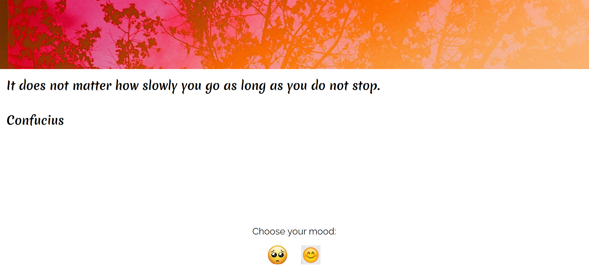
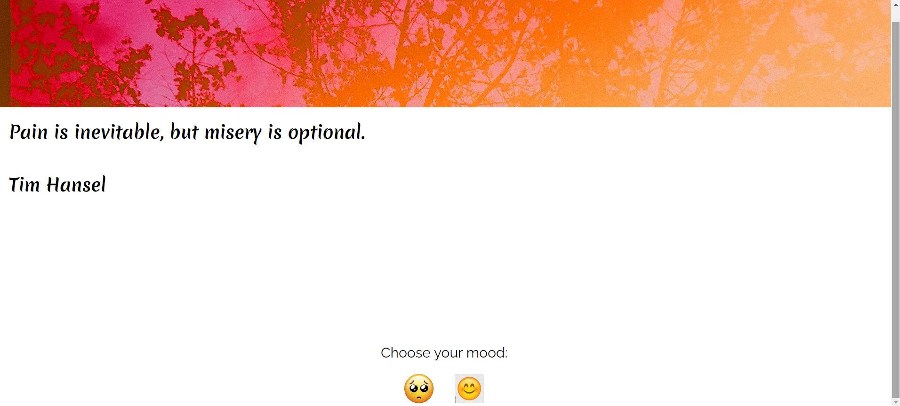

# Sentiment_based_Quote_Generator

## Overview
The Sentiment-Based Quote Web Application is designed to provide users with quotes that reflect different sentiments. Users can explore quotes based on their mood, either darker or brighter, through a user-friendly interface. The application also features a dynamic background banner to enhance visual appeal.

## Screenshots

![Alt text]  
  

## Features
Sentiment Analysis: Quotes are analyzed for sentiment and sorted to provide options for darker or brighter moods. 
Responsive Design: Optimized for both desktop and mobile devices. 

## Technologies Used
Frontend: HTML, CSS, JavaScript 
Backend: Flask (Python) 
APIs: NLTK for sentiment analysis 
Data Storage: CSV file for storing quotes 
Dynamic Content: Embedded Canva banner for background visuals 

## Usage
Home Page: Displays a random quote and an embedded Canva banner.
Navigation Buttons: Click the darker or brighter buttons to find quotes matching your mood.

